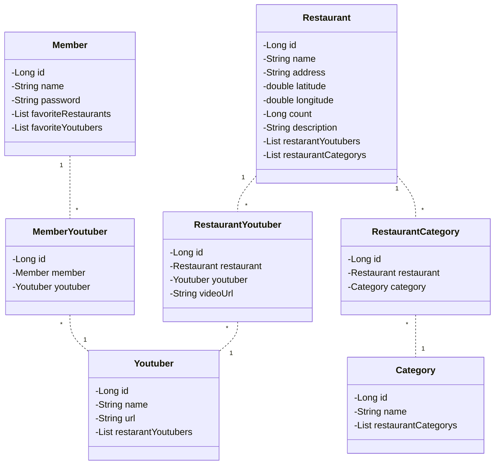
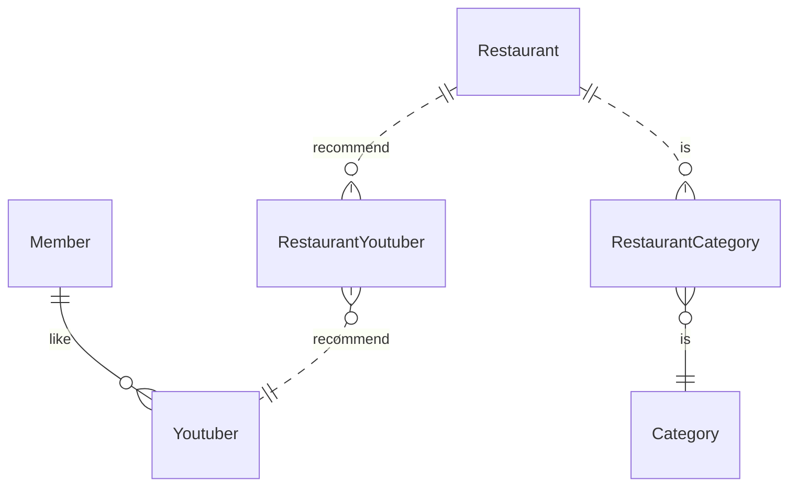
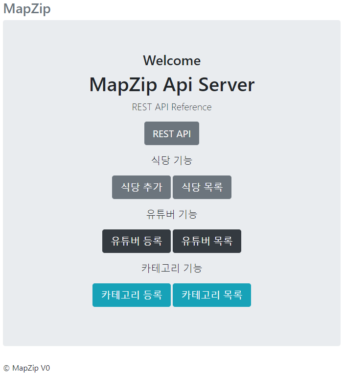
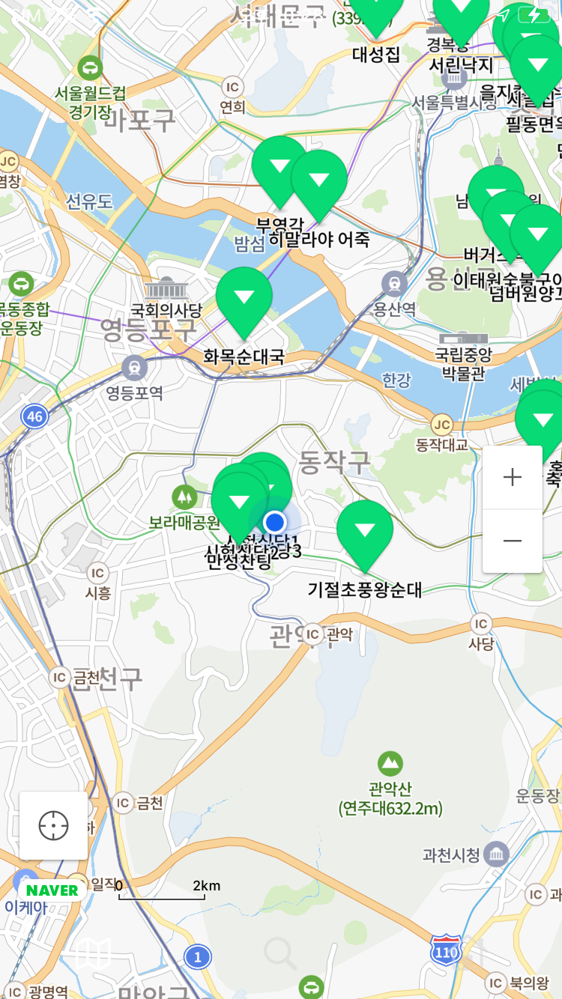
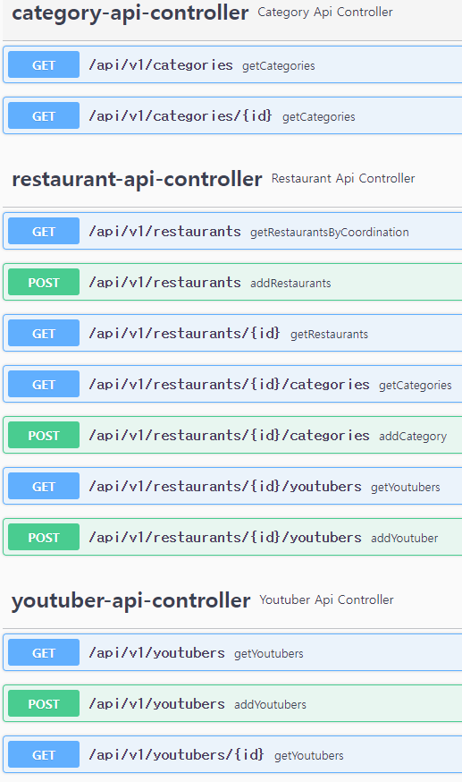

# MAPZIP

## 프로젝트 환경

- 프레임워크 : SpringBoot2
- DB 연결 : SpringDataJPA

- API 문서화 : Swagger
- 서버 : AWS EC2 t2
- DB : AWS RDS MariaDB

## 기능

- 식당

  - 식당 조회
    - 좌표 기반으로 조회.
    - 상세 조회 카테고리 리스트, 유튜버 리스트 함께 조회.
  - 식당 등록
  - 식당 제거
  - 식당에 카테고리 등록&연결
  - 식당에 유튜버 등록&연결

- 카테고리

  - 카테고리 생성.
  - 카테고리로 식당 조회.

- 유튜버

  - 유튜버 등록
  - 유튜버로 식당 조회.

- ~~회원~~
  - 회원 가입
  - 회원 조회
  - 회원 탈퇴
  - 좋아하는 유튜버 리스트

## ClassDiagram

## ER Diagram

## 레이아웃

- 관리자 페이지

  

- 앱 화면

  

## REST API List

- Swagger로 자동 생성.

## 요구사항

### 식당 저장

- 식당 주소는 도로명으로 변환되어 저장.
- 식당 주소로 부터 좌표 값을 얻어와 저장.
