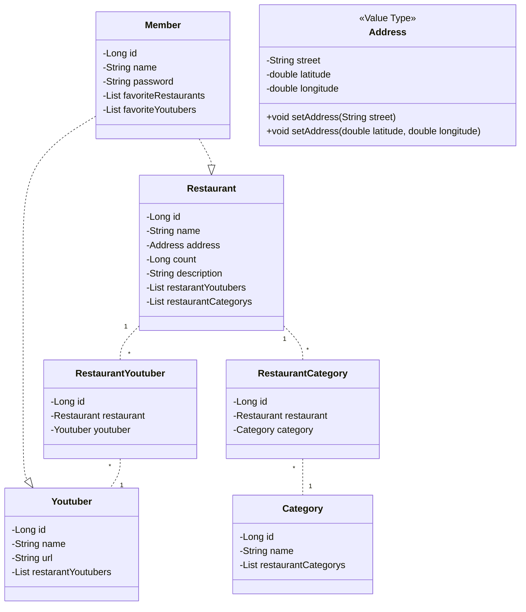
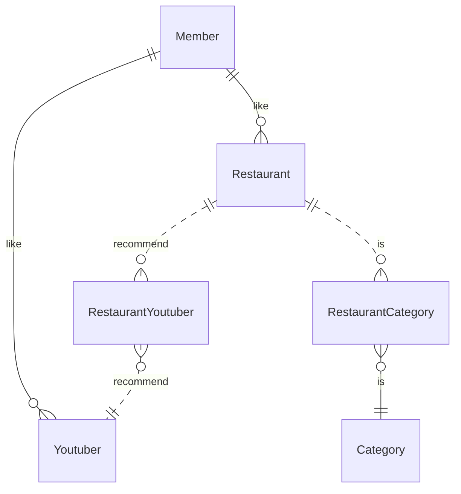

# MAPZIP

## 기능

- 식당
  - 식당 조회
    - 카테고리 표현.
  - 식당 등록
  - 식당 제거
  - 식당 카테고리 등록
- 카테고리
  - 카테고리로 식당 조회.
  -
- 유튜버
- 회원

## ClassDiagram

## ER Diagram

## 식당 저장

- 식당 주소는 도로명으로 변환되어 저장.
- 식당 주소로 부터 좌표 값을 얻어와 저장.
